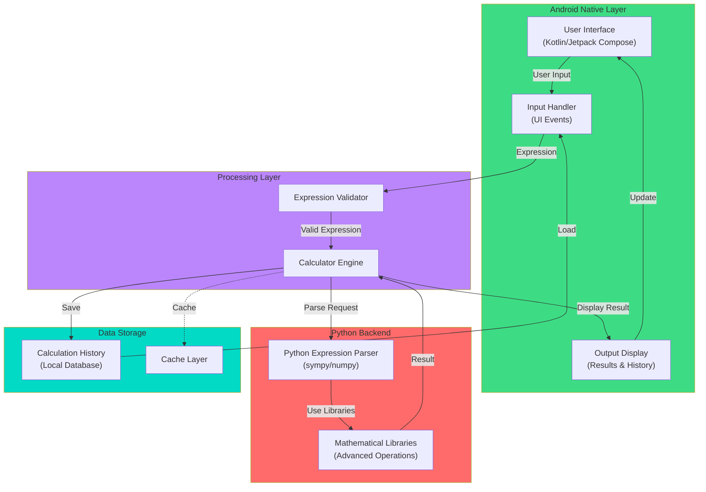

<h1 align="center">Composer Calculator</h1>

Инженерный калькулятор, в котором совмещено нативная Android-разработка и мощь 
Python-библиотек. Основная идея была в том, чтобы не писать велосипед для парсинга сложных 
математических выражений на Kotlin, а использовать возможности библиотек Python.

