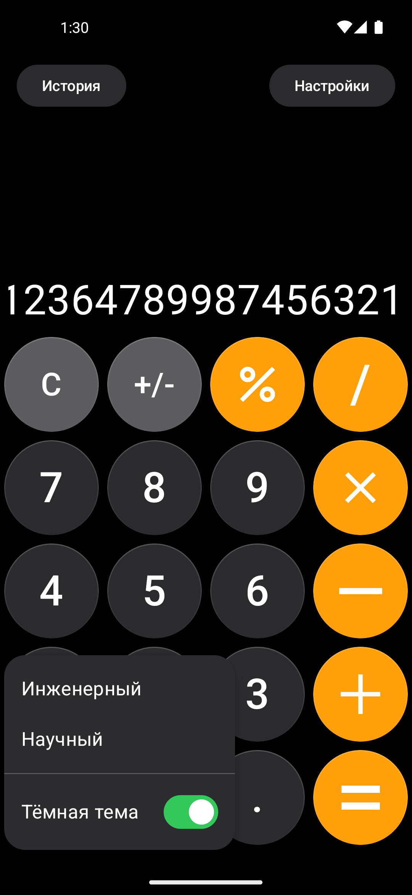
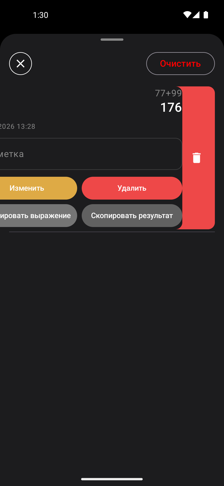

# 🧮 Composer Calculator

### Современный калькулятор на Jetpack Compose с интеграцией Python

## 📱 Интерфейс

<table>
  <tbody>
  <tr>
    <td align="center" rowspan="3">
        
    </td>
    <td></td>
    <td align="center" rowspan="2">
        
    </td>
  </tr>
  <tr>
    <td align="center" rowspan="3">
     
    </td>
  </tr>
  <tr>
    <td align="center" rowspan="3">
        
    </td>
  </tr>
  <tr>
    <td align="center" rowspan="2">
        
    </td>
  </tr>
  <tr>
    <td></td>
  </tr>
  </tbody>
</table>
