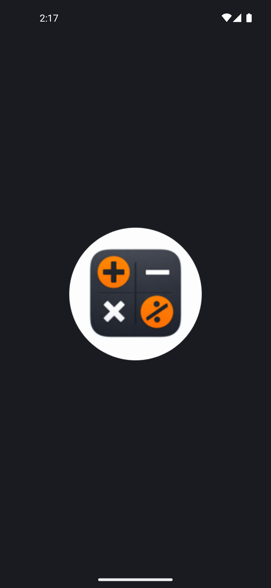

# 🧮 Composer Calculator

### Современный калькулятор на Jetpack Compose с интеграцией Python

## 📱 Интерфейс

[//]: # ()
[//]: # (|                                           Главный экран                                            |                                                Настройки                                                 |                                                 История                                                  |                                                 О приложении                                                 |)

[//]: # (|:--------------------------------------------------------------------------------------------------:|:--------------------------------------------------------------------------------------------------------:|:--------------------------------------------------------------------------------------------------------:|:------------------------------------------------------------------------------------------------------------:|)

[//]: # (|  |  |  |  |)

<table>
  <tbody>
  <tr>
    <td align="center" rowspan="3">
        
    </td>
    <td></td>
    <td align="center" rowspan="2">
        
    </td>
  </tr>
  <tr>
    <td align="center" rowspan="3">
     
    </td>
  </tr>
  <tr>
    <td align="center" rowspan="3">
        
    </td>
  </tr>
  <tr>
    <td align="center" rowspan="2">
        
    </td>
  </tr>
  <tr>
    <td></td>
  </tr>
  </tbody>
</table>

## ✨ Особенности

* **Точные вычисления:** Использование Python скриптов для обхода проблем с плавающей точкой (
  `0.1 + 0.2 = 0.3`).
* **Умный ввод:** Автоматическая подстановка точек после нуля и корректная обработка знаков.
* **Динамический UI:** Адаптивный размер шрифта и горизонтальная прокрутка в стиле iOS 18.
* **Темы:** Поддержка встроенных и пользовательских тем с хранением в Room.
* **История:** Сохранение всех вычислений с возможностью добавления заметок.

## 🛠 Технологии

- **UI:** Jetpack Compose (Declarative UI)
- **Архитектура:** MVVM + Clean Architecture (Use Cases)
- **База данных:** Room (хранение истории и состояний)
- **Логика вычислений:** Python (через библиотеку Chaquopy)
- **Фоновые задачи:** Coroutines & Flow