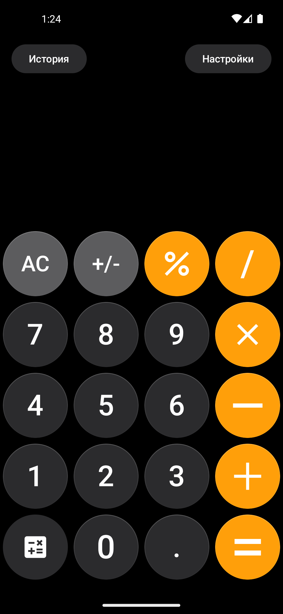

# 🧮 Composer Calculator
### Современный калькулятор на Jetpack Compose с интеграцией Python

## 📱 Интерфейс

|                                                   Главный экран                                                   | Настройки | История | О приложении |
|:-----------------------------------------------------------------------------------------------------------------:|:---------:|:-------:|:------------:|
|  |           |         |              |

## ✨ Особенности
* **Точные вычисления:** Использование Python скриптов для обхода проблем с плавающей точкой (`0.1 + 0.2 = 0.3`).
* **Умный ввод:** Автоматическая подстановка точек после нуля и корректная обработка знаков.
* **Динамический UI:** Адаптивный размер шрифта и горизонтальная прокрутка в стиле iOS 18.
* **Темы:** Поддержка встроенных и пользовательских тем с хранением в Room.
* **История:** Сохранение всех вычислений с возможностью добавления заметок.

## 🛠 Технологии
- **UI:** Jetpack Compose (Declarative UI)
- **Архитектура:** MVVM + Clean Architecture (Use Cases)
- **База данных:** Room (хранение истории и состояний)
- **Логика вычислений:** Python (через библиотеку Chaquopy)
- **Фоновые задачи:** Coroutines & Flow