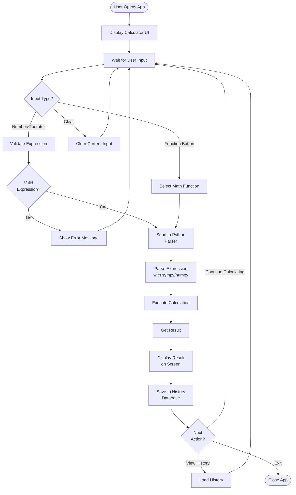
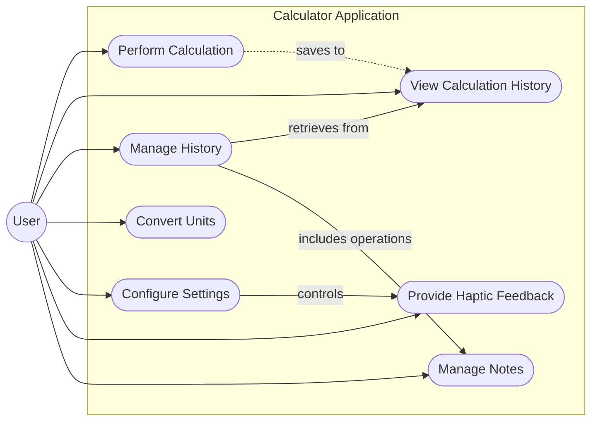

```mermaid
flowchart TD
    Start([User Opens App]) --> ShowUI["Display Calculator UI"]
    ShowUI --> WaitInput["Wait for User Input"]
    WaitInput --> InputType{Input Type?}
    
    InputType -->|Number/Operator| ValidateInput["Validate Expression"]
    InputType -->|Function Button| SelectFunc["Select Math Function"]
    InputType -->|Clear| ClearHistory["Clear Current Input"]
    
    ValidateInput --> IsValid{Valid<br/>Expression?}
    IsValid -->|No| ShowError["Show Error Message"]
    ShowError --> WaitInput
    
    IsValid -->|Yes| SendPython["Send to Python<br/>Parser"]
    SelectFunc --> SendPython
    
    SendPython --> ParseExpr["Parse Expression<br/>with sympy/numpy"]
    ParseExpr --> Calculate["Execute Calculation"]
    Calculate --> GetResult["Get Result"]
    
    GetResult --> DisplayResult["Display Result<br/>on Screen"]
    DisplayResult --> SaveHistory["Save to History<br/>Database"]
    SaveHistory --> WaitNext{Next<br/>Action?}
    
    WaitNext -->|Continue Calculating| WaitInput
    WaitNext -->|View History| ShowHistory["Load History"]
    ShowHistory --> WaitInput
    WaitNext -->|Exit| End([Close App])
    
    ClearHistory --> WaitInput
```

```mermaid
flowchart LR
    User((User))
    
    subgraph Calculator["Calculator Application"]
        UC1([Perform Calculation])
        UC2([View Calculation History])
        UC3([Manage History])
        UC4([Convert Units])
        UC5([Configure Settings])
        UC6([Provide Haptic Feedback])
        UC7([Manage Notes])
    end
    
    User --> UC1
    User --> UC2
    User --> UC3
    User --> UC4
    User --> UC5
    User --> UC6
    User --> UC7
    
    UC1 -.->|saves to| UC2
    UC3 -->|retrieves from| UC2
    UC3 -->|includes operations| UC7
    UC5 -->|controls| UC6
```